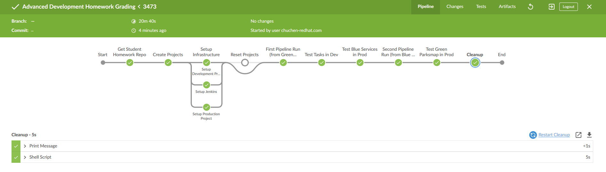
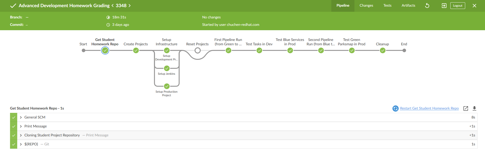

# OpenShift Advanced Development Homework

- GUID: 6b1d
- REPO: https://github.com/BennyChenChuhui/advdev_homework_template.git
- CLUSTER: na311.openshift.opentlc.com
- USER: chuchen-redhat.com
- CONSOLE: https://master.na311.openshift.opentlc.com

# Running Result is as follows.
- HOST: https://jenkins-gpte-jenkins.apps.na311.openshift.opentlc.com
- ID: 3473

- HOST: https://jenkins-gpte-jenkins.apps.na311.openshift.opentlc.com
- ID: 3348

# rh-homework
